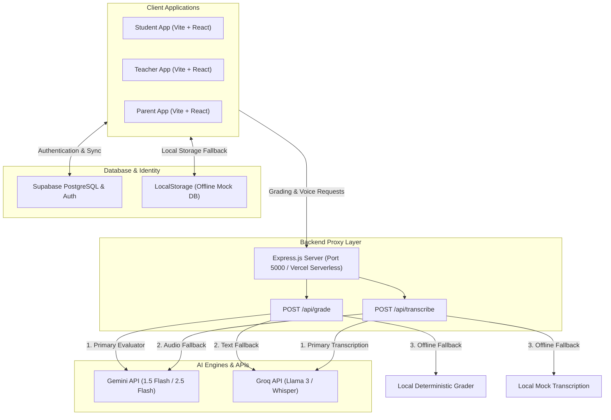

# Gyan-Setu (Gyan-Setu Board Prep & AI Feedback Platform)

Gyan-Setu is an adaptive, multi-role board exam practice and feedback platform tailored for CBSE and ICSE Class 10/12 students. Moving beyond traditional video-based instruction, Gyan-Setu emphasizes hands-on mathematics practice, examiner-grade step-by-step AI evaluation, and secure synchronization between students, teachers, and parents.

---

## System Architecture

The following diagram illustrates the relationship between the client applications, the secure backend proxy, the database layers, and the external AI service orchestration:



### Data Flow & Orchestration
1. **Authentication**: Users sign in via Supabase Auth. The system retrieves and matches their role (Student, Teacher, or Parent) to tailor the experience.
2. **Submitting Answers**: Students can submit answers using text, voice (audio recording), or photos of handwritten worksheets.
3. **AI Grading Orchestration**:
   - The React client sends the request to the secure Express proxy.
   - For photos, the proxy sends the image to the **Gemini 1.5 Flash Vision** model, applying specific examiner instructions and strict OCR guidelines.
   - If the Gemini API key is not present or the API fails, the server falls back to **Groq Vision** (Llama 4 Scout / Llama 3.2 Vision).
   - For text or voice responses, the server uses **Groq Llama 3.3 (70B)**.
   - If all API options are unavailable, the system invokes a **Local Deterministic Grader** to compute a structured score based on keyword mappings, ensuring zero UI freezes.
4. **Voice Transcription**: 
   - Audio is sent to the Express proxy.
   - The proxy attempts to transcribe it using **Groq Whisper API (whisper-large-v3)**.
   - If Groq fails, it falls back to **Gemini 2.5 Flash** audio input.
   - If no API is configured, a mock transcription is returned.

---

## Core Features

### 1. Multimodal Practice Arena
* **Curriculum Alignment**: Loaded with 40 classic CBSE/ICSE Class 10 mathematical board questions covering high-frequency concepts from the past decade.
* **Flexible Input Methods**:
  * **Text**: Standard mathematical syntax input via keyboard.
  * **Voice**: Audio recordings transcribed using the Groq Whisper API.
  * **Photo**: High-resolution photos of handwritten worksheets analyzed by Gemini 1.5 Flash Vision.

### 2. Examiner-Grade Step-by-Step AI Evaluation
* **Granular Grading**: Individual mathematical steps are evaluated independently. Students earn partial marks for correct formulas or methods even if an arithmetic calculation error occurs at the end.
* **Strict Rubrics**: The grading model applies standard board marking schemes (e.g., full credit for correct method & values, 50% partial credit for method-only, zero for incorrect formulas).
* **Secure API Proxy**: Express.js proxy routes hide API keys from the frontend client bundles.

### 3. Multi-Role Collaboration
* **Teachers**: Generate unique Class Codes, review aggregate class analytics, identify common conceptual errors, and add custom board questions to the database.
* **Students**: Join using a Class Code to practice questions, view detailed examiner feedback cards, and track progress.
* **Parents**: Enter their child's email address to monitor attempts, chronological scoring histories, and access diagnostic study recommendations.

---

## Technology Stack

* **Frontend**: React (Vite), Tailwind CSS (glassmorphism dashboard interface), Lucide React (icons).
* **Backend**: Node.js, Express.js.
* **Database**: Supabase PostgreSQL with custom schemas for users, classes, questions, and attempts.
* **Deployment**: Optimized for serverless hosting on Vercel (`vercel.json` rewrites).

---

## Local Development Setup

The application features local mock fallbacks. If no database or API keys are configured, it automatically runs an in-browser mock database (LocalStorage) and client/server-side mock grading.

### Prerequisites
* [Node.js](https://nodejs.org/) (v18 or higher recommended)
* npm (comes with Node.js)

### Installation

1. Clone the repository and navigate to the project directory:
   ```bash
   cd Gyan-Setu-AI-main
   ```
2. Install frontend dependencies:
   ```bash
   npm install
   ```
3. Install backend server dependencies:
   ```bash
   cd server
   ```
   ```bash
   npm install
   ```
   ```bash
   cd ..
   ```

### Configuration (Optional)

To enable live AI evaluations and remote database sync, create environment configuration files.

#### Backend Configuration
Create a `.env` file inside the `server/` directory:
```env
PORT=5000
GEMINI_API_KEY=your_gemini_api_key
GROQ_API_KEY=your_groq_api_key
```

#### Frontend Configuration
Create a `.env` file in the root directory:
```env
VITE_SUPABASE_URL=https://your-project.supabase.co
VITE_SUPABASE_ANON_KEY=your_supabase_anon_key
VITE_BACKEND_URL=http://localhost:5000
```
*Note: If `VITE_BACKEND_URL` is omitted in development mode, it defaults to `http://localhost:5000`.*

### Running the Application

For full functionality, start both the frontend and backend servers.

1. **Start the Backend Proxy Server**:
   ```bash
   cd server
   npm run dev
   ```
2. **Start the Frontend Application**:
   Open a separate terminal window at the project root and run:
   ```bash
   npm run dev
   ```
3. Open [http://localhost:5173](http://localhost:5173) in your browser.

---

## Database Configuration

For Supabase deployment, copy and run the DDL commands in [database/schema.sql](file:///Users/luqmaan/Desktop/Gyan-Setu-AI-main/database/schema.sql) inside the Supabase SQL Editor.
